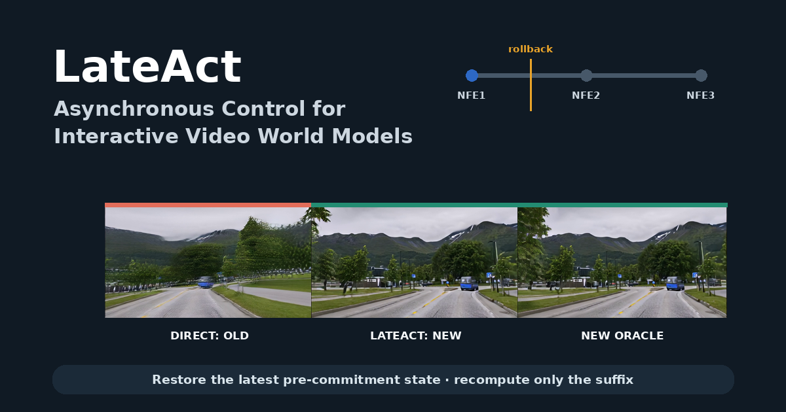

# LateAct: Commitment-Aware Rollback for Asynchronous Control in Interactive Video World Models

LateAct is a training-free serving policy that handles actions arriving during
denoising by rolling back only to the latest operationally safe commitment
boundary, rather than accepting a stale action or restarting the whole block.

[Project page](./index.html) · [Demo video](./showcase/lateact_demo.mp4)



## Headline results

- **0.218 → 0.997 response:** minimal rollback restores near-restart mouse-yaw
  response after a late action arrives.
- **11.93% lower mean late-arrival latency** than full restart across 676 late
  arrivals in the frozen serving evaluation.
- **1,024 paired asynchronous arrivals:** all 676 late cases reached near-restart
  response with fewer NFEs; all 348 early cases used zero rollback.
- **339,360-byte exact checkpoint:** 1,913× smaller than the initial exact
  checkpoint representation.

Correct serving inference uses the eight independent Matrix-Game base images:
the mean late-arrival response improvement over direct binding is 0.909136
(base-cluster bootstrap 95% CI [0.859769, 0.954093]), and the mean latency
saving over full restart is 0.311789 s (95% CI [0.305519, 0.317523]).

## Validated scope

Matrix-Game 2.0 mouse-yaw is the full LateAct efficacy setting. Its future-SSIM
is broadly stable but not uniform (median 0.922305; 60/64 comparisons at least
0.85). Keyboard control shares the same commitment boundary and recovers
directional response, but fails the frozen trajectory-fidelity safeguard
(future-SSIM 0.6726 < 0.90); it does not support an action-general efficacy
claim.

The original minWM a/d test failed its oracle-separation replication gate
(6/16). One pre-specified frozen j/l yaw follow-up passed all 16/16 commitment
gates. This independently replicates the commitment mechanism only: minWM did
not test LateAct rollback efficacy or latency.

## Evidence hierarchy

1. Gate 0 maps the denoising-time commitment curve.
2. Gate 1 validates minimal rollback against direct binding and full restart.
3. Gate 2 evaluates paired asynchronous arrivals, checkpoint cost, latency,
   response, and trajectory quality.
4. Keyboard and minWM experiments delimit action and model generalization.

## Implementation

- `src/lateact/` contains runtime intervention, rollback, checkpoint, and audit
  code.
- `scripts/` contains frozen gate and analysis entry points.
- `config/` contains frozen protocols and thresholds.
- `showcase/` contains the lightweight project-page assets.

Preview the static page locally from the repository root:

```bash
python3 -m http.server 8000
```

Then open `http://localhost:8000/`.
